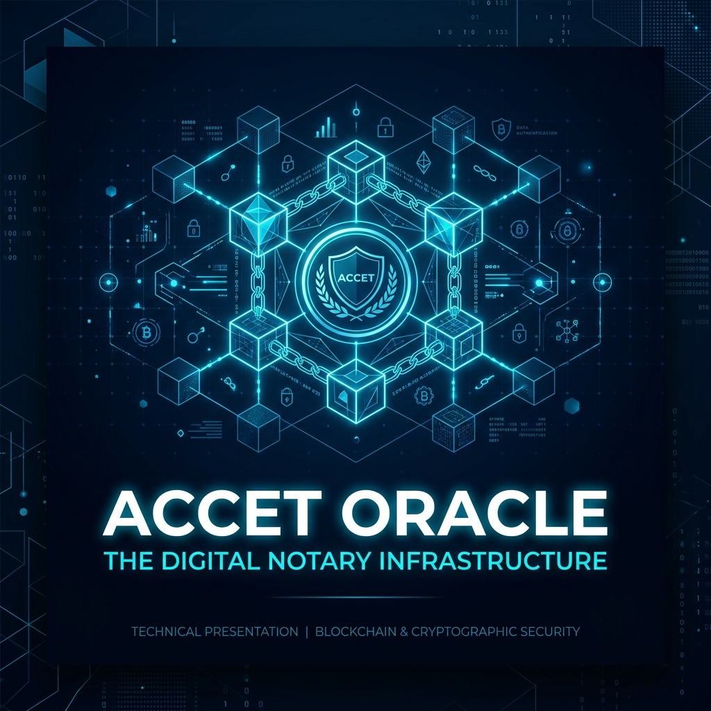
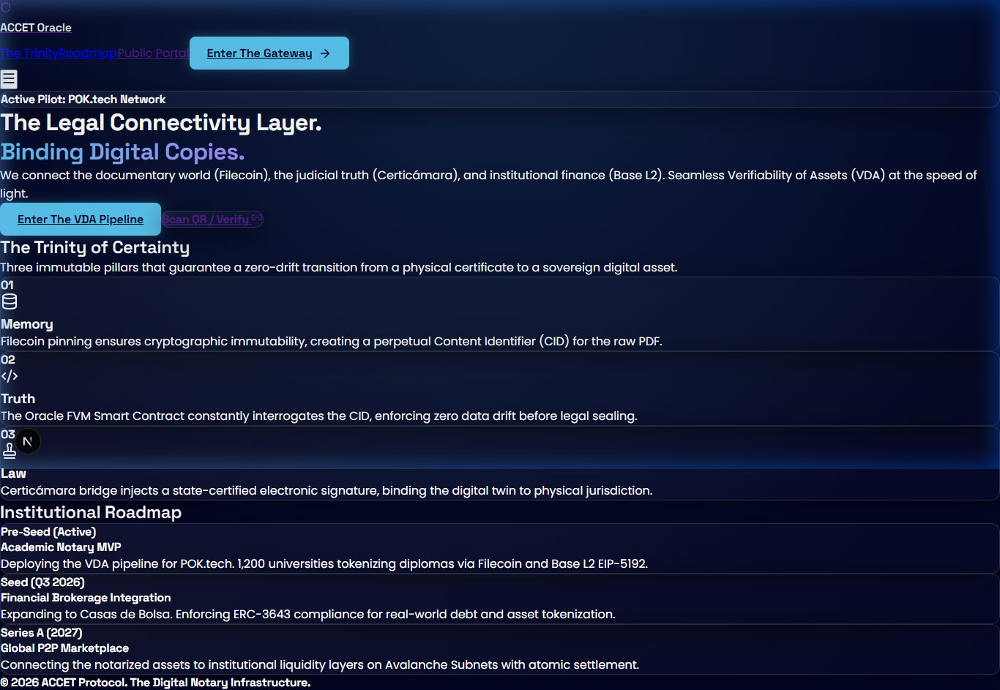
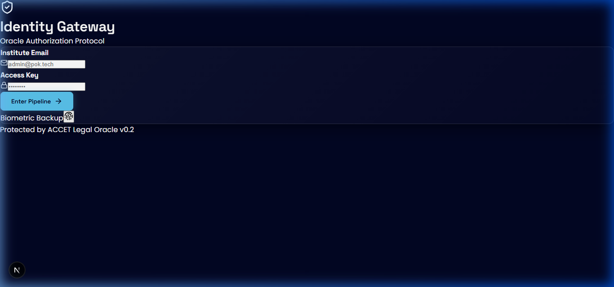
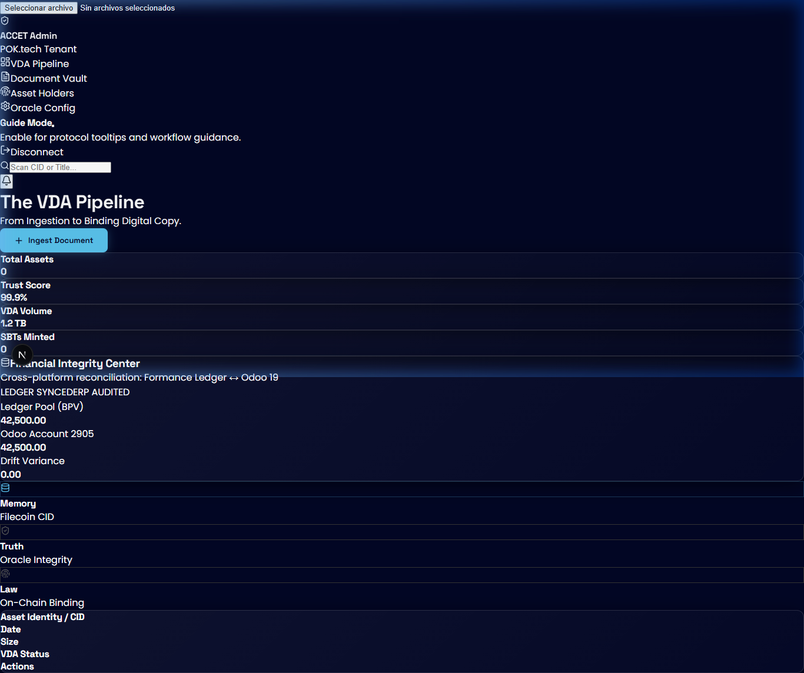
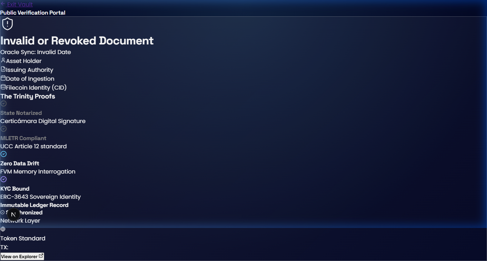

# 🏆 ACCET Oracle: UX Case Study & Presentation
**The Digital Notary Infrastructure for RWA Tokenization**

---

## 🛰️ 1. The Entry Point: The Gateway of Light
**Objective:** Establish authority, security, and a clear institutional roadmap.

### UX Evaluation:
- **Visual Narrative:** The "Trinity of Certainty" (Memory, Truth, Law) clearly explains the complex tech stack (Filecoin + FVM + Certicámara) in a way that institutional investors can understand.
- **Interaction:** The primary CTA "Enter The Gateway" is prominently placed, guiding the user towards the identity authorization phase.
- **Tone:** The "Midnight Corporate" palette (Deep Blue + Platinum) communicates stability and high-tech sovereignty.

---

## 🔐 2. Identity Gateway: Secure Authorization
**Objective:** Enforce multi-tenant security and session protection.

### UX Evaluation:
- **Simplicity:** A minimalist, focused login experience that minimizes cognitive load for tenant administrators.
- **Security Perception:** The dark theme and clean typography reinforce the "Dark Tech Authority" aesthetic.

---

## 📊 3. Tenant Dashboard: The VDA Pipeline
**Objective:** Real-time asset ingestion and cross-platform financial reconciliation.

### UX Evaluation:
- **Core Feature (VDA Pipeline):** The pipeline stepper provides visual feedback on the state of the asset (Memory ↔ Truth ↔ Law).
- **GoTrader Integration:** The **Financial Integrity Center** is a major UX win. Displaying the Ledger Pool and Odoo Account reconciliation side-by-side provides "Zero-Drift" transparency.
- **Information Density:** High-value stats (AUM, Trust Score, VDA Volume) are accessible at a glance without cluttering the workspace.

---

## 🛡️ 4. Public Portal: Sovereign Verification
**Objective:** Provide immutable proof of asset integrity to third parties.

### UX Evaluation:
- **Clarity of Proof:** "The Trinity Proofs" (State Notarized, Zero Data Drift, KYC Bound) provide a checklist of trust for any external auditor.
- **Transparency:** The "View on Explorer" link directly connects the legal document with its on-chain digital twin.

---

## 📈 Final UX Verdict: Institutional Ready
The ACCET Oracle journey successfully transforms a complex technical process into a **sovereign, intuitive, and auditable experience**.

- **Aesthetics:** 10/10 (Premium, consistent, and mission-aligned).
- **Usability:** 9/10 (Clear CTAs, logical flow, though real-time feedback for long Filecoin operations is essential).
- **Narrative Alignment:** 10/10 (The "Legal Oracle" mission is evident in every screen).

> [!TIP]
> To export this as a PDF, use the browser's **Print to PDF** function (Ctrl+P) on the rendered version of this document.
